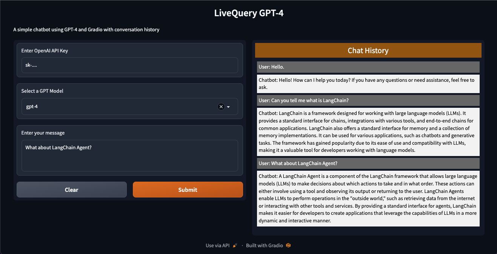
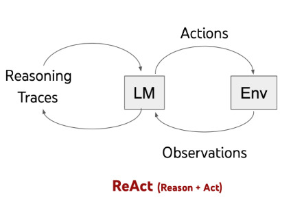

# Chatbot for data knowledge
ChatBot for your company data knowledge with UI

## Conversation Example
### UI


### How it works

1. User asks a question
2. Chatbot searches for the answer in the company's Confluence wiki or Jira or Google Chats backup (semantic search) via langchain API
3. If the answer is not found, the chatbot asks the user to clarify the question
4. If the answer is found, the chatbot displays it to the user

### Agent uses ReAct Agent Policy from LangChain framework:


## Installation

1. Clone this repository:
```
git clone https://github.com/Xaik89/chatbot_for_data_knowledge.git
```

2. Install the required packages:
```
pip install -r requirements.txt
```

3. Create a `.env` file with all environment variables needed:
```
OPENAI_API_KEY="your_openai_api_key"

CONFLUENCE_API_TOKEN="your_confluence_api_token"
CONFLUENCE_API_USER="your_confluence_api_user"
CONFLUENCE_WIKI_URL="your_confluence_wiki_url"

JIRA_API_TOKEN="your_jira_api_token"
JIRA_USERNAME="your_jira_username"
JIRA_INSTANCE_URL="your_jira_instance_url"

G_CHATS_BACKUP_PATH="your_google_chats_backup_path"
```

## Usage

1. Run the server:
```
python main.py
```

2. Open the Gradio interface in your web browser at http://127.0.0.1:7860